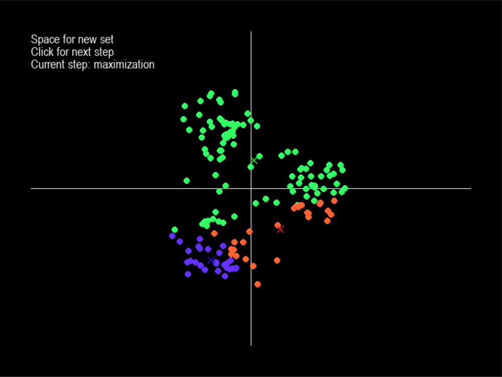
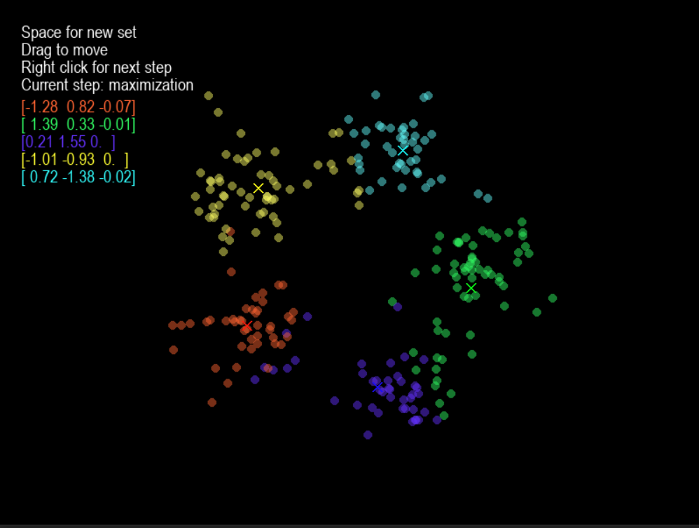
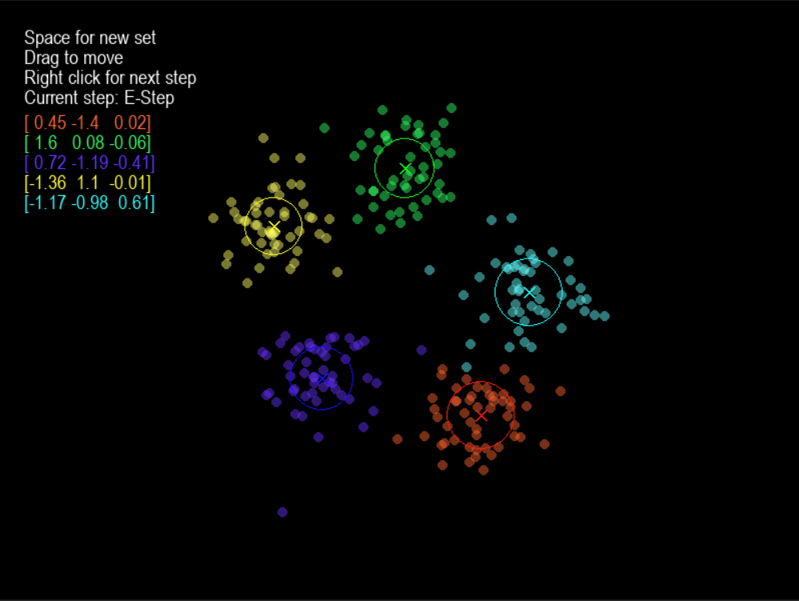
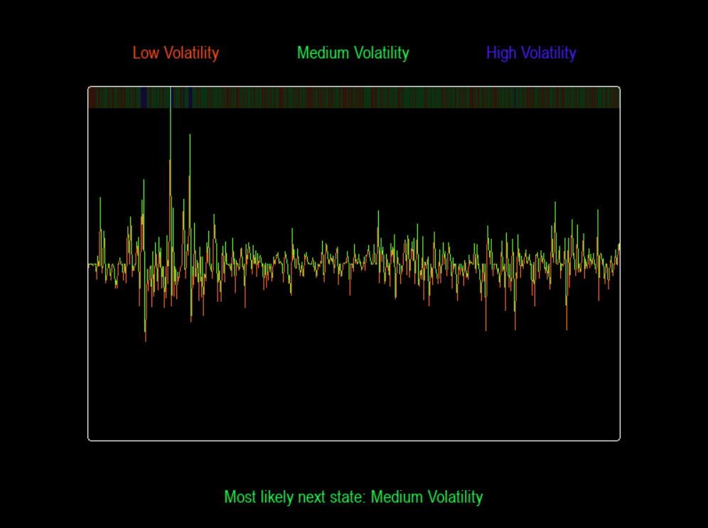

# CS 315/E414/ML-A 742 Visualizer

This tool is designed to help you visualize the output of the various algorithms 
developed in CS 315/E414/ML-A 742. 

It is written in Python and uses the following libraries:
 - Pygame
 - Numpy
 - Scipy

Some helper libraries are implemented to ensure that each algorithm is implemented
the way it would outside of this course.
```
hmmlearn
sklearn.mixture._gaussian_mixture
sklearn.linear_model.LogisticRegression
```
### [Current Features](#current-features) · [Installation](#Installation) · [Future Features](#future-features) 

## Current Features
- 2D K-Means Clustering
- 3D K-Means Clustering
- 3D Gaussian Mixture Models
- Logistic Regression (On MNIST)
- Hidden Markov Models (On USD/BTC exchange rates)

## Installation
1. Ensure that you have [installed pip](https://pip.pypa.io/en/stable/installing/). 
2. Clone the repository
    ```commandline
    pip install  git+https://github.com/christoffellis/CS-315-E414-ML-A-742-Visualizer
   ```
3. Install the requirements (from the root directory)
```commandline
pip install -r requirements.txt
```
4. Run the main.py file (from the root directory)
```commandline
python main.py
python3 main.py
py3 main.py
```

## Usage

### K-Means Clustering

#### 2D



#### 3D



### Gaussian Mixture Models

#### 3D



### Logistic Regression

#### MNIST


### Hidden Markov Models

#### USD/BTC Exchange Rates




## Future Features
- Implementation of user loaded algorithms
- More algorithms
- Additional visualization for HMMs