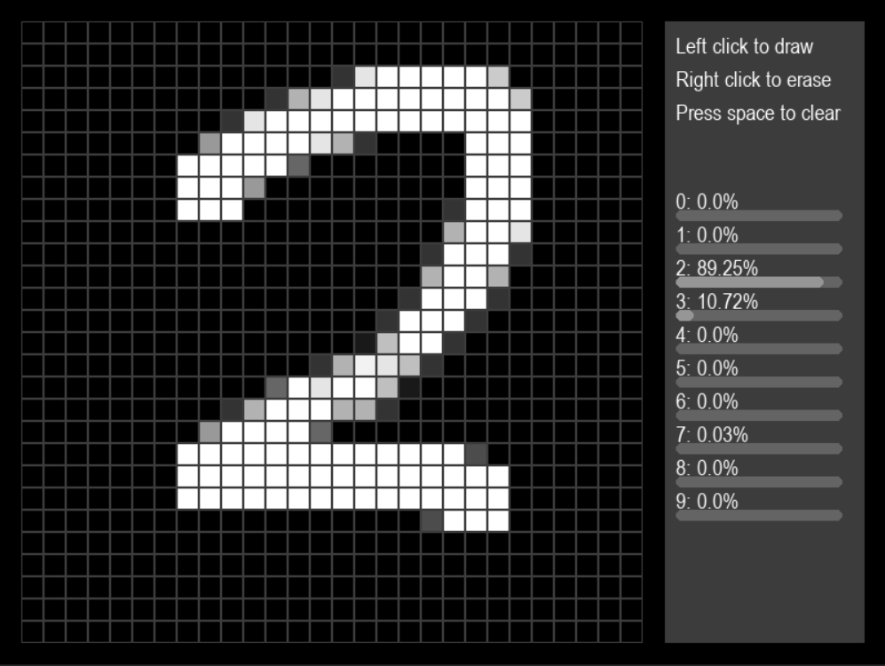

# CS 315/E414/ML-A 742 Visualizer

This tool is designed to help you visualize the output of the various algorithms 
developed in CS 315/E414/ML-A 742. 

It is written in Python and uses the following libraries:
 - Pygame
 - Numpy
 - Scipy

Some helper libraries are implemented to ensure that each algorithm is implemented
the way it would outside of this course.
```
hmmlearn
sklearn.mixture._gaussian_mixture
sklearn.linear_model.LogisticRegression
```
## Index
### · [Current Features](#current-features)
### · [Installation](#Installation)
### · [Usage](#usage)
### · [Future Features](#future-features) 
### · [Config](#config)

## Current Features

### Algorithms
- 2D K-Means Clustering
- 3D K-Means Clustering
- 3D Gaussian Mixture Models
- Logistic Regression (On MNIST)
- Hidden Markov Models (On USD/BTC exchange rates)

### Others
#### Own implementation of K-Means Clustering can be implemented
Implement in `user_classes/k_means.py` and add `iterate()` method to the class.
The visualizer will check to see if the method exists and use it if it does.

## Installation
1. Ensure that you have [installed pip](https://pip.pypa.io/en/stable/installing/). 
2. Clone the repository
    ```commandline
    pip install  git+https://github.com/christoffellis/CS-315-E414-ML-A-742-Visualizer
    ```
3. Install the requirements (from the root directory)
    ```commandline
    pip install -r requirements.txt
    ```
4. Run the main.py file (from the root directory)

    ```commandline
    python main.py
    ```
    or
    ```commandline
    python3 main.py
    ```
    or
    ```commandline
    py3 main.py
    ```

## Usage

### K-Means Clustering

#### 2D


#### 3D


### Gaussian Mixture Models

#### 3D


### Logistic Regression

#### MNIST



### Hidden Markov Models

#### USD/BTC Exchange Rates


## Config
A configuration file, `config.ini`, is used to set the parameters for each algorithm.
The parameters are as follows:
### kmeans2d
- `cluster_count` - The number of clusters to use (default: 3), [1, 6]
- `x_variance` - The variance of the x values (default: 0.1)
- `y_variance` - The variance of the y values (default: 0.1)

### kmeans3d
- `cluster_count` - The number of clusters to use (default: 3), [1, 6]
- `x_variance` - The variance of the x values (default: 0.1)
- `y_variance` - The variance of the y values (default: 0.1)
- `z_variance` - The variance of the z values (default: 0.1)

### gmm3d
- `cluster_count` - The number of clusters to use (default: 3), [1, 6]
- `x_variance` - The variance of the x values (default: 0.1)
- `y_variance` - The variance of the y values (default: 0.1)
- `z_variance` - The variance of the z values (default: 0.1)

## Future Features
- Implementation of user loaded algorithms
- More algorithms
- Additional visualization for HMMs
- More user friendly interface for changing parameters